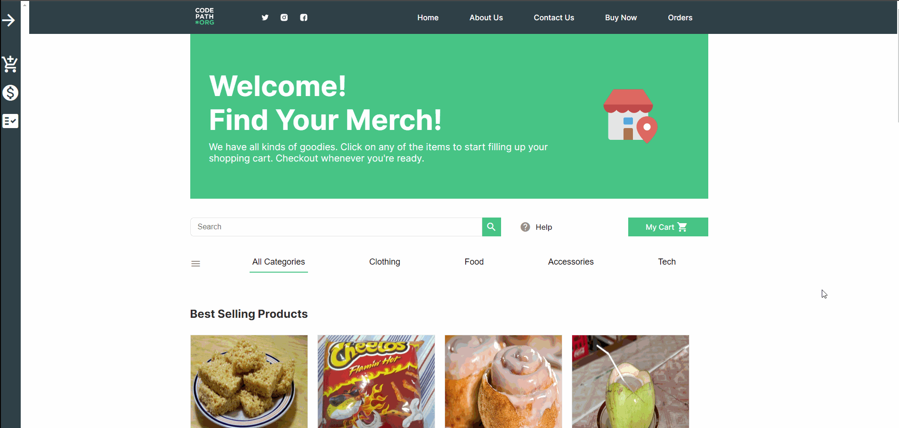

# Project #2: Student Store

## Overview

Selling merchandise in the modern era requires digital solutions. For this project, I designed and constructed an online student store for the College of Codepath. The application entails a frontend user interface for potential customers to peruse the goods, and a backend API to handle data management. The API will be built with Node and Express and the UI will be built with React.

### Application Features

- Displays the following sections: header, banner, search, product grid, about, contact, and footer.
- On initial page load, display the products at the [GET /store endpoint](http://localhost:3001/store).
- User can click on the categories (Clothing, food, etc) to filter the product grid by type.
- User can search for products.
- User can click on a product in the grid to view additional product details. Navigation is via a React Router.
- User can click to expand the shopping cart in the left navigation.
- User can click the '+' button on a product cart to increment that product in the shopping cart.
- User can click the '-' button on a product cart to increment that product in the shopping cart.
- Shopping cart displays a table of products, quantities, subtotal, tax, and total.
- User can check out, and can view receipt upon completion.
- User can click in the top navigation bar to scroll to the relevant section.
- User sees a "not found" display when searching for a nonexistent product.
- Create an endpoint for fetching all orders in the database, and an endpoint for serving an individual order based on its id.
- Build a page in the UI that displays the list of all past orders and lets the user click on any individual order to take them to a more detailed page of the transaction.
- Allow users to use an input to filter orders by the email of the person who placed the order.

### Walkthrough Video
 
 
 
 
